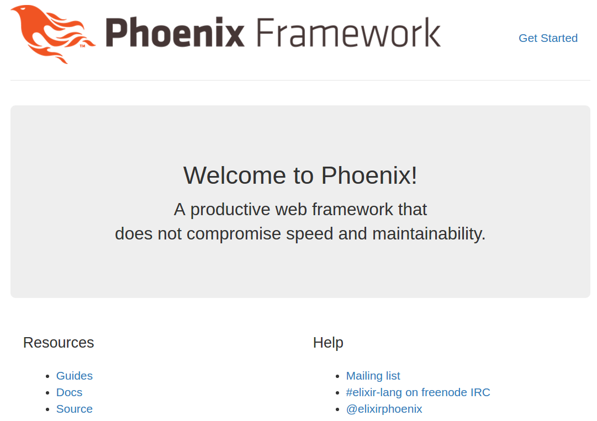

I'm documenting my experience installing Phoenix on Ubuntu 14.04 in the hopes
that I can help others avoid some problems I ran into. I'll be brief
when the [official documentation](http://www.phoenixframework.org/docs/installation)
serves me well. When the documentation leaves me confused, I'll explain what I
did to resolve the issues.

## Install dependencies

#### Install Elixir & Erlang  

Follow the [Elixir installation guide](http://elixir-lang.org/install.html)

#### Install Hex 

```bash
$ mix local.hex
```

#### Install Node.js

Follow the [Node.js download page](https://nodejs.org/en/download/). **Note that
you need to install Node.js >= 5.0.0**. This is specified in the
Phoenix installation guide, but I missed it in my first pass.

Since I'm on Ubuntu, I'll follow [these
instructions](https://Nodejs.org/en/download/package-manager/#debian-and-ubuntu-based-linux-distributions) for Node.js v6:

```bash
$ curl -sL https://deb.nodesource.com/setup_6.x | sudo -E bash -
$ sudo apt-get install -y nodejs
```

#### Install PostgreSQL

```bash
$ sudo apt-get install postgresql
```

#### Install inotify-tools

```bash
$ sudo apt-get install inotify-tools
```

## Install Phoenix

```bash
$ mix archive.install https://github.com/phoenixframework/archives/raw/master/phoenix_new.ez
```

## Create a project

```bash
$ mix phoenix.new hello
$ cd hello
```

## Create an Ecto repo

```bash
$ mix ecto.create
```

This step gave me some trouble. I received this output:

    ** (Mix) The database for Hello.Repo couldn't be created: FATAL
    (invalid_password): password authentication failed for user "postgres"
    16:35:22.980 [error] GenServer #PID<0.147.0> terminating
    ** (Postgrex.Error) FATAL (invalid_password): password authentication failed for
    user "postgres"
        (db_connection) lib/db_connection/connection.ex:148:
    DBConnection.Connection.connect/2
        (connection) lib/connection.ex:623: Connection.enter_connect/5
        (stdlib) proc_lib.erl:240: :proc_lib.init_p_do_apply/3
    Last message: nil
    State: Postgrex.Protocol
    You may also need to alter your postgreSQL configuration to ensure it works
    with Ecto. I had to alter the postgres user. You can do this using the `psql` 
    terminal:

If you get something similar, you may have to alter the postgres user password
in your postgreSQL configuration[^1]. Do this:

[^1]: More info here: [http://www.phoenixframework.org/docs/ecto-models](http://www.phoenixframework.org/docs/ecto-models)

```bash
# Start the psql terminal
$ sudo -u postgres psql

psql (9.3.13)
Type "help" for help.

postgres=# ALTER USER postgres PASSWORD 'postgres';
postgres=# ALTER USER postgres WITH SUPERUSER;
```

## Start the Phoenix application

```bash
$ mix phoenix.server
```

If everything went well, you should see the default Phoenix landing page:


